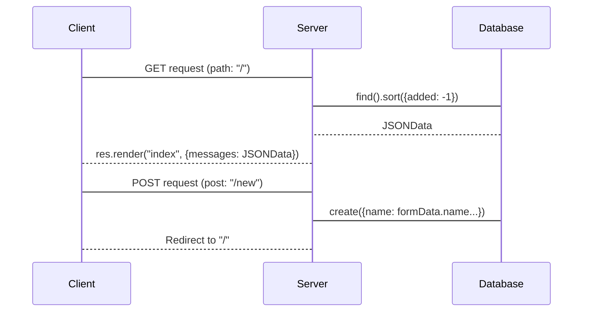

# Bullet - The Express Message Board

This repository containt a very simple fullstack application.
The application is called Bullet. A Bullet can be seen as a post.

## What I learned:

- The importance of conditional rendering.
- The importance of error handling.
- What and ORM/ODM is.
- How to use mongoose.
- How to use Pug.

## The Stack:

- **💻 Backend:** ExpressJS
- **📰 View engine:** Pug
- **🌟 Styiling:** Tailwind
- **💾 DB:** MognoDB
- **🔀 ORM:** Mongoose

## The Structure

